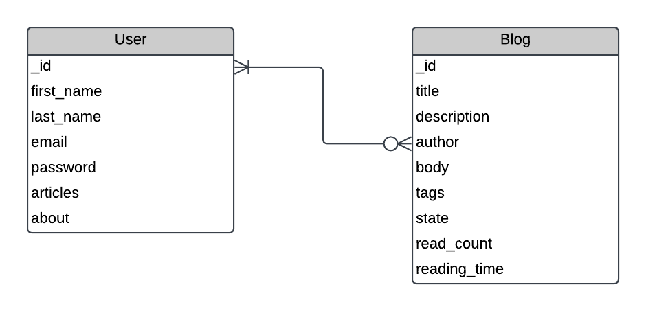

# Blogging Api

The Blogging Api is a REST API that expose different end-points which enable users to create account, create blogs, perform CRUD operations on blogs created by them, and also view blogs created by other users.

The API was built as capstone project for [3MTT Backend Enginerering internship program](https://3mtt.nitda.gov.ng/) Powered by Nigeria's Federal Ministry of Communications, Innovation and Digital Economy in collaboration with ALT School Africa.

## Implemented Features

- User Sign up and authentication
- CRUD functionality for blogs
- API testing

## Main Technologies Used

- NODE.js
- Express
- MongoDB (Mongoose)
- Passport.js
- Jest and supertest

## Entity Relationship Diagram (ERD)



## Setup

To run this application locally:

1. Clone this repo

```bash
$ git clone https://github.com/twikista/blog-api
```

2. Go the root of the cloned repo and install dependencies

```bash
$ cd blog-api && npm install
```

## Usage

To start the application, run ` npm run dev` to start the development server at http://localhost:4000/
